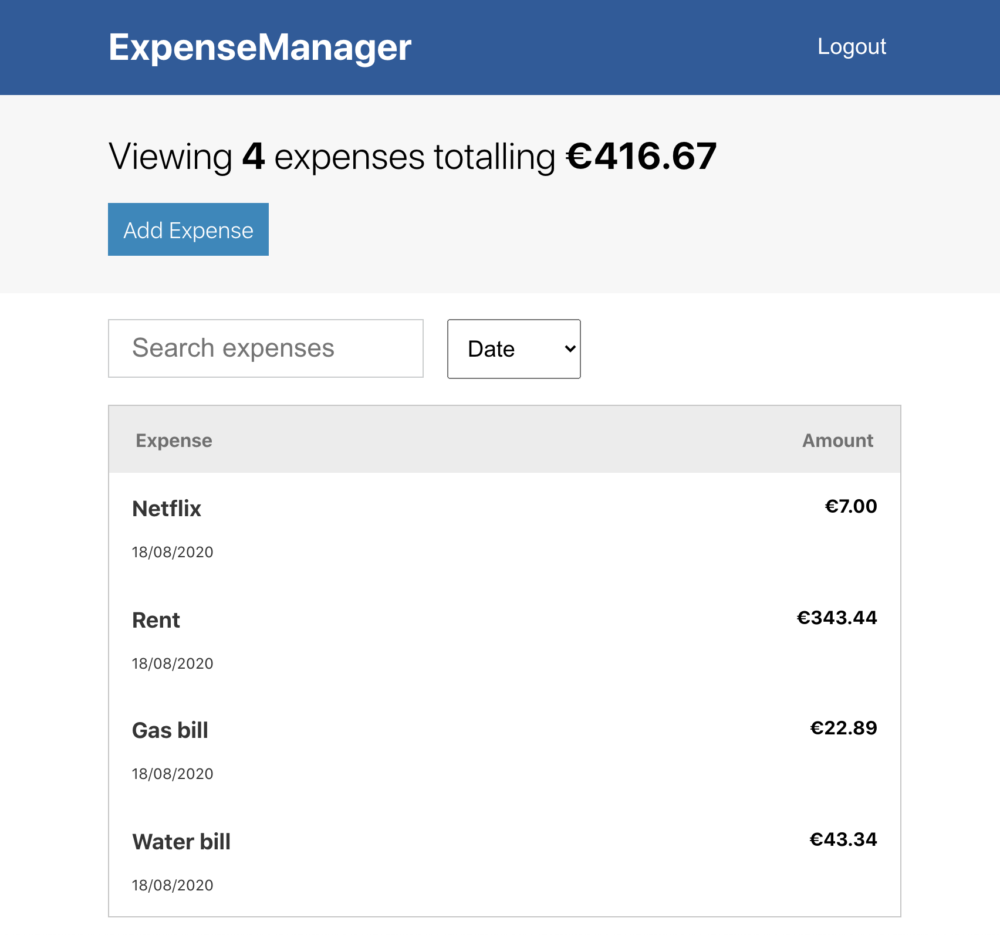

# ExpenseManager

### Manage expenses easily

React web app to manage expenses. Uses Redux to manage state.

Web app is live at [https://marco2012.github.io/ExpenseManager/](https://marco2012.github.io/ExpenseManager/) .

